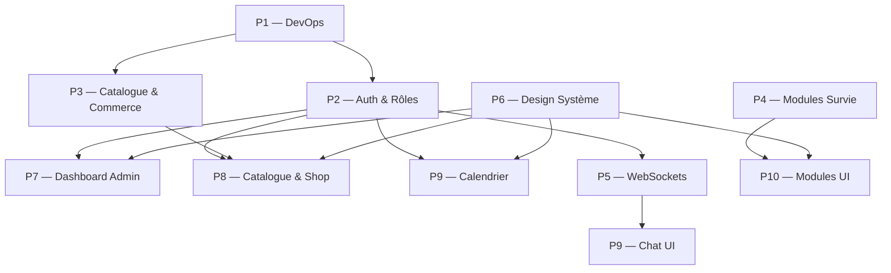

# Guide de développement — Cendres & Vapeur

> [!abstract] Objectif
> Répartition des tâches pour **10 développeurs** sur **8 jours** (J1–J8) suivie d'une soutenance J10.
> Stack : **FastAPI (Python)** · **React 19 + TypeScript** · **SQL** · **WebSockets**

## Composition de l'escouade

| # | Rôle | Périmètre principal |
|---|------|---------------------|
| P1 | Chef de projet / DevOps | GitHub, CI, intégration, revues |
| P2 | Backend — Auth & Sécurité | OAuth, 2FA, gestion des rôles |
| P3 | Backend — Catalogue & Commerce | Produits, panier, commandes, factures |
| P4 | Backend — Modules Survie | Toxicité, fluctuation prix, logs publics |
| P5 | Backend — Temps réel & Emails | WebSockets (chat), emails Mailtrap/SendGrid |
| P6 | Frontend Lead — Design système | Composants partagés, A11Y, CSS steampunk |
| P7 | Frontend — Auth & Dashboard | Login, 2FA UI, dashboard admin |
| P8 | Frontend — Catalogue & Shop | Catalogue, votes, panier, tunnel d'achat |
| P9 | Frontend — Calendrier & Chat | Chronométre de la colonie, notes de quart, chat UI |
| P10 | Frontend — Modules Survie | Toxicité UI, Bourse du Cuivre, Journal des Survivants |

---

## Planning par jour

### J1 — Fondations

> [!warning] Journée critique — rien ne peut commencer sans elle

**Tous ensemble (matin) :**
- Valider le schéma SQL ensemble (au moins 30 min)
- Définir les conventions : nommage, branches Git, format des commits (`Major.minor.patch`)
- Créer les branches : `main` · `develop` · `feat/auth` · `feat/catalogue` etc.

| Qui | Tâches du jour |
|-----|---------------|
| **P1** | Créer repo GitHub · branches · protéger `main` · Figma / maquette globale |
| **P2** | Schéma SQL (users, sessions, codes_2fa, rôles) · modèles Pydantic Auth |
| **P3** | Schéma SQL (products, orders, order_items, coupons) · modèles Pydantic |
| **P4** | Schéma SQL (toxicity_logs, price_history, activity_logs) |
| **P5** | Schéma SQL (messages, conversations) · choix lib WebSocket |
| **P6** | Maquette Figma (palette steampunk, typographie, composants clés) |
| **P7** | Maquette écrans Auth (login, 2FA, register) |
| **P8** | Maquette catalogue, fiche produit, panier |
| **P9** | Maquette calendrier (vue mois/semaine), note de quart |
| **P10** | Maquette module toxicité (alerte rouge), bourse cuivre (flèches) |

---

### J2–J4 — Noyau

> [!tip] Priorité absolue : Auth + API de base. Tout le reste en dépend.

#### J2

| Qui | Tâches |
|-----|--------|
| **P1** | Configurer l'environnement : `.env`, CORS, init DB (`uv run fastapi dev`) |
| **P2** | Endpoint `POST /auth/register` + hashage mot de passe |
| **P2** | Endpoint `POST /auth/login` → génère token + code 2FA → envoi email |
| **P3** | CRUD produits : `GET /products`, `POST /products`, `PUT /products/{id}` |
| **P4** | Endpoint `GET /toxicity/current` → données aléatoires Python |
| **P5** | Serveur WebSocket de base (`/ws/chat`) — connexion/déconnexion |
| **P6** | Init projet React : Vite + TypeScript · variables CSS globales (couleurs cuivre) |
| **P6** | Composant `Button`, `Card`, `Loader` (animation rouages) |
| **P7** | Page `Login.tsx` (formulaire, validation) |
| **P8** | Page `Catalogue.tsx` (liste produits, skeleton loader) |
| **P9** | Composant `Calendar.tsx` (grille mensuelle de base) |
| **P10** | Composant `ToxicityBar.tsx` (jauge avec seuil) |

#### J3

| Qui | Tâches |
|-----|--------|
| **P1** | Mise en place guard middleware (rôles : Invité, Utilisateur, Éditeur, Admin) |
| **P2** | Endpoint `POST /auth/verify-2fa` · `POST /auth/logout` · refresh token |
| **P2** | Tests unitaires Auth (pytest) |
| **P3** | Endpoint `POST /cart`, `GET /cart/{user_id}`, `DELETE /cart/{item_id}` |
| **P3** | Endpoint `POST /orders` (validation commande) |
| **P4** | Algorithme fluctuation prix : `views_count` + `sales_count` → prix ajusté |
| **P5** | Auth WebSocket : seuls Admin/Éditeur peuvent se connecter |
| **P5** | Config email : Mailtrap ou SendGrid (test envoi 2FA) |
| **P6** | Composant `NavBar.tsx` (avec aria-labels, navigation clavier) |
| **P6** | Composant `Modal.tsx`, `Badge.tsx`, `Alert.tsx` |
| **P7** | Page `Verify2FA.tsx` · intégration token → `localStorage` / cookie |
| **P8** | Page `ProductDetail.tsx` + bouton vote "Pression Populaire" |
| **P9** | Intégration API événements → calendrier |
| **P10** | Intégration API toxicité → jauge + bascule "Alerte Rouge" (CSS global) |

#### J4

| Qui | Tâches |
|-----|--------|
| **P1** | Revue de code globale · merge branches stables vers `develop` |
| **P2** | Endpoint admin : `GET /users`, `PUT /users/{id}/role`, `DELETE /users/{id}` |
| **P3** | Endpoint `POST /coupons/apply` (codes réduction) |
| **P3** | Génération facture HTML imprimable / PDF |
| **P4** | Endpoint `GET /activity-logs` (Journal des survivants — public) |
| **P5** | Endpoint `POST /contact` → email formaté via SMTP |
| **P6** | Responsive design mobile (breakpoints) · tests accessibilité (axe-core) |
| **P7** | Page `AdminDashboard.tsx` (tableau de bord : users, produits, commandes) |
| **P8** | Page `Cart.tsx` + `Checkout.tsx` + simulateur de paiement |
| **P9** | Composant `ShiftNote.tsx` (note matin/soir, CRUD via API) |
| **P10** | Page `CopperExchange.tsx` (prix dynamique, flèches hausse/baisse) |

---

### J5–J6 — Modules avancés

#### J5

| Qui | Tâches |
|-----|--------|
| **P1** | Tests d'intégration end-to-end (Playwright ou manuel) |
| **P2** | Sécurisation des routes (403 si rôle insuffisant) · audit sécurité |
| **P3** | Tri dynamique des produits par votes (`ORDER BY likes DESC`) |
| **P4** | WebSocket côté Python pour push toxicité en temps réel (optionnel) |
| **P5** | Chat : persistance des messages en DB · pagination (`GET /chat/messages`) |
| **P6** | Animation CSS : rouages sur les loaders · bordures cuivre brossé |
| **P7** | Gestion profil utilisateur (`/profile`) · changement mot de passe |
| **P8** | Page `Invoice.tsx` (affichage + bouton imprimer) |
| **P9** | Vue hebdomadaire calendrier · distinction jours chargés (couleurs) |
| **P10** | Page `SurvivorsJournal.tsx` (flux public, refresh auto toutes les 10s) |

#### J6

| Qui | Tâches |
|-----|--------|
| **P1** | Variables d'environnement propres · préparer démo (données de seed) |
| **P2** | Tests unitaires supplémentaires · documentation endpoints (Swagger auto) |
| **P3** | Endpoint statistiques admin : CA total, top produits, commandes récentes |
| **P4** | Endpoint `POST /toxicity/simulate` (déclenche manuellement une alerte) |
| **P5** | UI Chat (`Chat.tsx`) : messages instantanés, indicateur "en ligne" |
| **P6** | Dark mode / thème unique steampunk cohérent sur toutes les pages |
| **P7** | Stats visuelles dans AdminDashboard (graphiques simples) |
| **P8** | Application code promo dans Checkout · recalcul total |
| **P9** | Persistance notes de quart → vérifier sync API |
| **P10** | Alerte rouge globale : CSS var `--alert-mode` toggle sur `<body>` |

---

### J7–J8 — Polissage & Tests finaux

| Qui | Tâches J7 | Tâches J8 |
|-----|-----------|-----------|
| **P1** | Merge final `develop → main` · tag version `1.0.0` | Répétition soutenance · préparation démo script |
| **P2** | Audit sécurité final (headers, rate limiting) | Doc individuelle : justification choix auth |
| **P3** | Tests panier (edge cases : stock 0, coupon invalide) | Doc individuelle : justification choix API |
| **P4** | Vérifier algorithme prix (pas de valeurs négatives) | Seed de données réalistes |
| **P5** | Tests WebSocket (déconnexion brutale, reconnexion) | Doc individuelle : justification WebSocket vs Long Polling |
| **P6** | Audit A11Y complet : tabindex, aria, contraste WCAG AA | Vérification responsive sur mobile |
| **P7** | Tests flux auth complet (register → 2FA → login → logout) | Doc individuelle : justification UX dashboard |
| **P8** | Tests tunnel d'achat complet (panier → paiement → facture) | Doc individuelle : justification votes |
| **P9** | Tests calendrier (création note, persistance après refresh) | Doc individuelle : justification calendrier |
| **P10** | Tests alerte rouge (seuil soufreé → toggle → retour normal) | Doc individuelle : justification modules survie |

---

## Dépendances critiques



> [!warning] Bloquants J1–J2
> - **P6 doit livrer les composants de base avant J3** pour que P7, P8, P9, P10 puissent travailler
> - **P2 doit livrer les endpoints auth avant J3** pour que les autres pages puissent gérer les tokens

---

## Conventions de travail

### Git

```
feat/auth-2fa          # nouvelle fonctionnalité
fix/cart-total-coupon  # correction de bug
chore/seed-database    # tâche technique sans impact user
```

**Format de commit** : `type(scope): description courte` — ex : `feat(auth): add 2FA email verification`

**Version** : `Major.minor.patch` — commencer à `0.1.0`, passer à `1.0.0` le J8 final.

### API

- Toutes les réponses en JSON
- Codes HTTP stricts : `200`, `201`, `400`, `401`, `403`, `404`, `500`
- Documentation auto via Swagger : `http://localhost:8000/docs`

### Réunions quotidiennes

| Moment | Format | Durée |
|--------|--------|-------|
| Matin (début) | Stand-up : qu'est-ce que j'ai fait hier / aujourd'hui / blocages | 10 min |
| Soir (fin) | Démo rapide de ce qui fonctionne + merge si prêt | 15 min |

---

## Checklist de livraison J8

- [ ] Schéma SQL migré et seedé avec données de démo
- [ ] Auth 2FA fonctionnelle (register → code email → login)
- [ ] 4 niveaux de rôles respectés et testés
- [ ] Catalogue avec prix dynamiques et votes
- [ ] Panier → paiement simulé → facture générée
- [ ] Moniteur de toxicité avec bascule "Alerte Rouge"
- [ ] Chronométre de la colonie (calendrier + notes de quart persistées)
- [ ] Chat WebSocket (Admin/Éditeur uniquement)
- [ ] Formulaire de contact (email envoyé)
- [ ] Journal des Survivants (flux public)
- [ ] CSS steampunk cohérent sur toutes les pages
- [ ] Navigation clavier + aria-labels sur tous les éléments interactifs
- [ ] Aucun commit avec message vague

---

## Liens utiles

- [[Bienvenue]] — note d'accueil du vault
- `docs/PROJECT.md` — sujet complet du TP
- `backend/app/main.py` — point d'entrée FastAPI
- `frontend/src/App.tsx` — point d'entrée React
- Mailtrap : https://mailtrap.io (pour tester les emails 2FA / contact)
- Swagger auto : `http://localhost:8000/docs`
