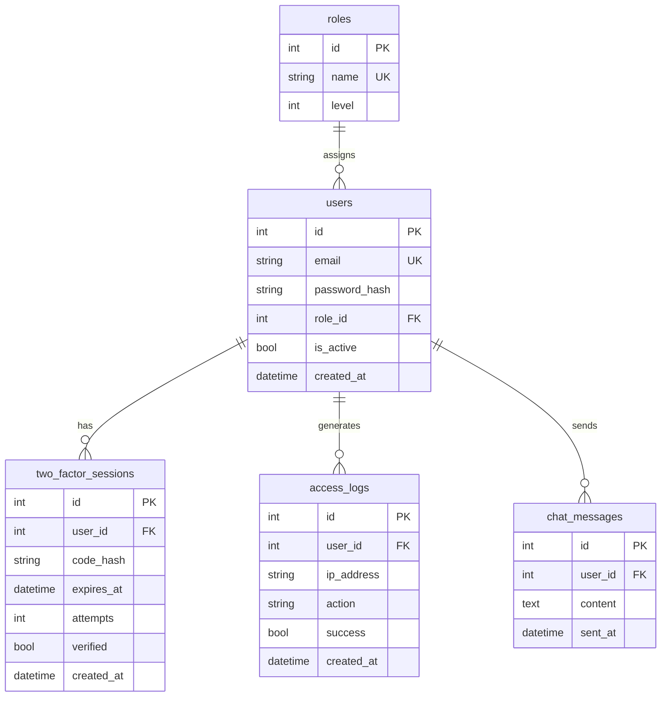

# Roadmap — Secteur Pourpre 🟣

> **Équipe : Secteur Pourpre** (11 membres) — Direction : Boudegna Philippe  
> Support basé sur `tp-fullstack-cendres-et-vapeur-juin-2026-webdevoo-formation.pdf`  
> Formateur : Dufrène Valérian — Webdevoo Formation (juin 2026)

---

## Table des matières

1. [Notre mission](#1-notre-mission)
2. [Interfaces avec les autres secteurs](#2-interfaces-avec-les-autres-secteurs)
3. [État actuel du dépôt (vue Pourpre)](#3-état-actuel-du-dépôt-vue-pourpre)
4. [Stack technique — périmètre Pourpre](#4-stack-technique--périmètre-pourpre)
5. [Planning Pourpre sur 10 jours](#5-planning-pourpre-sur-10-jours)
6. [Phase 0 — Cadrage sécurité (J1)](#6-phase-0--cadrage-sécurité-j1)
7. [Phase 1 — Auth, rôles & transmissions sécurisées (J2–J4)](#7-phase-1--auth-rôles--transmissions-sécurisées-j2j4)
8. [Phase 2 — WebSockets & emails (J5–J6)](#8-phase-2--websockets--emails-j5j6)
9. [Phase 3 — Durcissement & intégration (J7–J8)](#9-phase-3--durcissement--intégration-j7j8)
10. [Phase 4 — Soutenance (J10)](#10-phase-4--soutenance-j10)
11. [Répartition suggérée au sein du Pourpre](#11-répartition-suggérée-au-sein-du-pourpre)
12. [Tables SQL — responsabilité Pourpre](#12-tables-sql--responsabilité-pourpre)
13. [Endpoints — responsabilité Pourpre](#13-endpoints--responsabilité-pourpre)
14. [Frontend — périmètre Pourpre](#14-frontend--périmètre-pourpre)
15. [Structure de dossiers cible](#15-structure-de-dossiers-cible)
16. [Référence projet global](#16-référence-projet-global)
17. [Discipline de travail](#17-discipline-de-travail)
18. [Checklist de livraison Pourpre](#18-checklist-de-livraison-pourpre)

---

## 1. Notre mission

Le **Secteur Pourpre** est l'élite chargée de la **sécurité des transmissions** et de l'**intégrité des communications**. Sans citoyenneté prouvée, aucun accès au Dashboard.

### Livrables principaux du Pourpre

| Module | Description | Priorité |
|--------|-------------|----------|
| **OAuth2 + 2FA** | Connexion, JWT, code par email (Mailtrap / SendGrid) | 🔴 Critique |
| **RBAC** | 4 rôles : Invité, Utilisateur, Éditeur, Administrateur | 🔴 Critique |
| **Middleware sécurité** | Protection routes, validation tokens, gestion erreurs `401`/`403` | 🔴 Critique |
| **Logs d'accès** | Traçabilité des connexions et tentatives échouées | 🟠 Haute |
| **Télégraphe de l'ombre** | Chat WebSocket admin/éditeur, messages instantanés | 🔴 Critique |
| **Service email** | Envoi codes 2FA + support bureau de poste (contact) | 🟠 Haute |
| **Frontend auth** | Login, 2FA, routes protégées, contexte utilisateur | 🔴 Critique |
| **Frontend chat** | Interface temps réel du télégraphe | 🟠 Haute |

### Ce qui n'est PAS notre périmètre principal

| Secteur | Responsabilité | Notre rôle |
|---------|----------------|------------|
| 🔵 **Cobalt** | API REST générale, intégration, flux de données | Fournir middleware auth + contrat d'interface |
| 🔴 **Rouille** | Schéma SQL global, persistance, algorithmes (bourse, toxicité) | Définir nos tables (`users`, `roles`, `two_factor_sessions`, `access_logs`, `chat_messages`) |
| 🎨 **Frontend / UX** | Vitrine, CSS post-apo, A11Y globale, e-commerce UI | Livrer les écrans auth + chat + guards de routes |

---

## 2. Interfaces avec les autres secteurs

### Contrats à verrouiller dès J1

```
┌─────────────────────────────────────────────────────────────┐
│                    SECTEUR POURPRE 🟣                        │
│  auth/ · security/ · websockets/ · email/ · middleware/   │
└──────────────┬──────────────────────────────┬───────────────┘
               │                              │
    JWT + rôle │                              │ WS / events
               ▼                              ▼
┌──────────────────────────┐    ┌────────────────────────────┐
│   SECTEUR COBALT 🔵      │    │   SECTEUR ROUILLE 🔴       │
│   routers métier         │    │   migrations SQL           │
│   e-commerce, planning   │    │   modèles + seed           │
└──────────────────────────┘    └────────────────────────────┘
               │                              │
               └──────────────┬───────────────┘
                              ▼
                    ┌─────────────────┐
                    │  FRONTEND 🎨    │
                    │  consomme auth  │
                    └─────────────────┘
```

### Points de synchronisation obligatoires

| Quand | Avec qui | Sujet |
|-------|----------|-------|
| **J1** | Rouille | Schéma des tables auth (`users`, `roles`, `two_factor_sessions`, `access_logs`, `chat_messages`) |
| **J1** | Cobalt | Convention headers (`Authorization: Bearer`), format erreurs JSON, structure `backend/app/` |
| **J3** | Cobalt | Injection du middleware RBAC sur leurs routers |
| **J3** | Frontend | Contrat `AuthContext` : login → 2FA → token → rôle |
| **J6** | Cobalt + Frontend | URL WebSocket, format messages chat, reconnexion |
| **J8** | Tous | Revue sécurité transversale avant soutenance |

### Format d'erreur JSON (imposé par le Pourpre à toute l'API)

```json
{
  "error": {
    "code": "INVALID_2FA_CODE",
    "message": "Le code de vérification est invalide ou expiré.",
    "status": 401
  }
}
```

---

## 3. État actuel du dépôt (vue Pourpre)

| Composant | État | Action Pourpre |
|-----------|------|----------------|
| **FastAPI** | 🟡 Squelette | CORS trop permissif (`*`) → à durcir |
| **Auth / 2FA** | 🔴 Absent | **Notre priorité #1** |
| **RBAC** | 🔴 Absent | Middleware + dépendances FastAPI |
| **WebSockets** | 🔴 Absent | Chat admin (J5–J6) |
| **Service email** | 🔴 Absent | Mailtrap / SendGrid pour 2FA |
| **Logs d'accès** | 🔴 Absent | Table + middleware logging |
| **Frontend auth** | 🔴 Absent | Pages login / 2FA / guards |
| **Tables SQL auth** | 🔴 Absent | Coordonner avec Rouille J1 |

**Prochaine action Pourpre** : cadrage sécurité J1 + création du module `backend/app/auth/` + maquette des écrans login/2FA.

---

## 4. Stack technique — périmètre Pourpre

| Domaine | Technologie | Usage |
|---------|-------------|-------|
| Auth | FastAPI `OAuth2PasswordBearer` + JWT (`python-jose` ou `PyJWT`) | Tokens access + refresh |
| Mots de passe | `passlib` + bcrypt | Hash sécurisé |
| 2FA | Code 6 chiffres, TTL 5 min, max 3 tentatives | Table `two_factor_sessions` |
| Email | Mailtrap ou SendGrid (tier gratuit) | Codes 2FA, contact |
| Temps réel | FastAPI WebSockets + fallback Long Polling | Télégraphe de l'ombre |
| Frontend auth | React Context + `react-router` guards | Session utilisateur |
| Frontend WS | API native `WebSocket` | Chat admin |
| Tests | pytest + httpx (backend), Vitest (frontend auth) | Couverture auth + RBAC |

### Dépendances Python à ajouter (`pyproject.toml`)

```
python-jose[cryptography]
passlib[bcrypt]
python-multipart
aiosmtplib          # ou SDK SendGrid
```

---

## 5. Planning Pourpre sur 10 jours

```
J1              J2────J3────J4           J5────J6              J7────J8         J9    J10
│               │                        │                     │                │     │
Cadrage         AUTH CORE                WS + EMAIL            Durcissement     QA    Soutenance
Tables auth     OAuth JWT 2FA            Télégraphe            Rate limit
Maquettes       RBAC middleware          Bureau de poste       Tests sécu
Contrats        Logs accès               Frontend chat         Intégration
```

| Jour | Focus Pourpre | Jalons |
|------|---------------|--------|
| **J1** | Cadrage | Tables auth validées avec Rouille, maquettes login/2FA/chat, `.env.example` sécurité |
| **J2** | Fondations auth | Modèles `User`, `Role`, `TwoFactorSession`, `AccessLog` + migrations |
| **J3** | 2FA | Login → email code → verify → JWT ; blocage dashboard sans 2FA |
| **J4** | RBAC | Middleware 4 rôles, handler erreurs JSON, logs d'accès actifs |
| **J5** | WebSocket backend | Endpoint `ws/chat`, auth WS via token, persistance messages |
| **J6** | WebSocket frontend + email | UI télégraphe, service email contact (bureau de poste) |
| **J7** | Durcissement | Rate limiting, CORS restrictif, expiration tokens, tests sécu |
| **J8** | Intégration | Middleware injecté sur routers Cobalt, polish auth UI, fallback Long Polling |
| **J9** | QA | Tests auth/RBAC/WS, scénario démo sécurité, fiches individuelles |
| **J10** | Soutenance | Démo 2FA + chat + RBAC, justification choix crypto |

---

## 6. Phase 0 — Cadrage sécurité (J1)

### 6.1 Coordination Rouille — tables auth

- [ ] Valider le schéma ER des tables Pourpre (voir [section 12](#12-tables-sql--responsabilité-pourpre))
- [ ] Définir les contraintes : `email` unique, `role_id` FK, expiration `two_factor_sessions`
- [ ] Seed des 4 rôles : `guest`, `user`, `editor`, `admin`
- [ ] Seed d'un compte admin de test + compte éditeur pour le chat

### 6.2 Coordination Cobalt — conventions API

- [ ] Structure dossiers partagée dans `backend/app/`
- [ ] Format d'erreur JSON unifié (section 2)
- [ ] Header `Authorization: Bearer <token>` sur toutes les routes protégées
- [ ] Documenter les niveaux de rôle requis par router (matrice RBAC)

### 6.3 Maquettage Pourpre (Figma)

- [ ] Écran **Connexion** (email + mot de passe, thème post-apo)
- [ ] Écran **Vérification 2FA** (saisie code 6 chiffres, compte à rebours expiration)
- [ ] Écran **Accès refusé** (401 / 403 — citoyenneté non prouvée)
- [ ] Widget **Télégraphe de l'ombre** (panneau chat admin/éditeur)
- [ ] Indicateur **session active** (nom, rôle, bouton déconnexion)

### 6.4 Setup initial

- [ ] Créer `backend/app/auth/`, `security/`, `websockets/`, `services/email.py`
- [ ] Rédiger `.env.example` avec `JWT_SECRET`, `MAILTRAP_*`, `JWT_EXPIRE_MINUTES`
- [ ] Kanban Pourpre opérationnel (1 tâche minimum par membre)
- [ ] Tag : `v0.1.0-pourpre`

---

## 7. Phase 1 — Auth, rôles & transmissions sécurisées (J2–J4)

> **Cœur de mission du Secteur Pourpre** — sans cette phase, le reste du projet est exposé.

### 7.1 Modèles & persistance (J2) — avec Rouille

- [ ] Modèle `Role` (id, name, level : 0–3)
- [ ] Modèle `User` (email, password_hash, role_id, is_active, created_at)
- [ ] Modèle `TwoFactorSession` (user_id, code_hash, expires_at, attempts, verified)
- [ ] Modèle `AccessLog` (user_id, ip, action, success, created_at)
- [ ] Migrations Alembic pour ces tables

### 7.2 Hiérarchie des rôles (J2–J3)

| Rôle | Niveau | Ce que le Pourpre enforce |
|------|--------|---------------------------|
| **Invité** | 0 | Routes publiques uniquement (pas de token) |
| **Utilisateur** | 1 | Token valide + 2FA vérifiée |
| **Éditeur** | 2 | Accès chat + gestion catalogue (via Cobalt) |
| **Administrateur** | 3 | Contrôle total |

- [ ] Enum `RoleLevel` côté backend
- [ ] Dépendance FastAPI `get_current_user` (vérifie JWT)
- [ ] Dépendance `require_role(min_level: int)`
- [ ] Dépendance `require_2fa_verified` (session 2FA active)
- [ ] Tests unitaires : chaque rôle accepté/refusé sur routes types

### 7.3 OAuth2 + 2FA (J3)

- [ ] `POST /auth/register` — inscription (hash bcrypt, rôle `user` par défaut)
- [ ] `POST /auth/login` — vérifie identifiants → génère code 2FA → envoie email
- [ ] `POST /auth/verify-2fa` — valide code → émet JWT access + refresh
- [ ] `POST /auth/refresh` — renouvellement token
- [ ] `POST /auth/logout` — invalidation (blacklist optionnelle ou suppression session)
- [ ] Intégration Mailtrap / SendGrid (template email « code de citoyenneté »)
- [ ] Limitation tentatives 2FA (lock après 3 échecs)
- [ ] **Règle métier** : routes `/admin/*` bloquées sans 2FA validée

### 7.4 Middleware & logs (J4)

- [ ] Handler global exceptions → JSON (`401`, `403`, `404`, `422`, `500`)
- [ ] Middleware logging : chaque requête authentifiée → `access_logs`
- [ ] Log des échecs : mauvais mot de passe, code 2FA invalide, accès non autorisé
- [ ] Durcissement CORS : remplacer `*` par origines explicites (localhost + prod)
- [ ] Documentation OpenAPI : routes auth taguées « Sécurité Pourpre »
- [ ] Tag : `v0.2.0-pourpre`

### 7.5 Frontend auth (J3–J4)

- [ ] `AuthContext` : état user, token, rôle, is2FAVerified
- [ ] Page `Login.tsx` + `Verify2FA.tsx`
- [ ] Intercepteur fetch : injection `Authorization` header
- [ ] `ProtectedRoute` : redirige vers login si non authentifié
- [ ] `RoleGuard` : masque/affiche selon niveau de rôle
- [ ] Gestion expiration token (refresh automatique ou redirect login)
- [ ] Stockage token : `sessionStorage` (pas `localStorage` — fermeture = déconnexion)

---

## 8. Phase 2 — WebSockets & emails (J5–J6)

### 8.1 Télégraphe de l'ombre — Backend WebSocket (J5)

- [ ] Endpoint `WS /ws/chat`
- [ ] Authentification WS : token JWT passé en query param ou premier message
- [ ] Vérification rôle ≥ Éditeur avant connexion
- [ ] Modèle `ChatMessage` (user_id, content, sent_at)
- [ ] Broadcast instantané à tous les clients connectés
- [ ] Persistance SQL de chaque message
- [ ] `GET /chat/history` — historique au chargement (REST complémentaire)
- [ ] Gestion déconnexion / reconnexion propre

### 8.2 Télégraphe de l'ombre — Frontend (J6)

- [ ] Hook `useWebSocket` avec reconnexion automatique
- [ ] Page `admin/Chat.tsx` (accessible Éditeur+)
- [ ] Liste messages temps réel + scroll auto
- [ ] Indicateur « en ligne » / « déconnecté »
- [ ] **Fallback Long Polling** si WebSocket échoue (exigence PDF)
- [ ] Style post-apo : messages style télégramme

### 8.3 Bureau de poste — Service email (J6)

> Le formulaire contact est un module global, mais l'**envoi email** relève du Pourpre.

- [ ] `POST /contact` — validation entrées + rate limiting
- [ ] Service `EmailService` réutilisable (2FA + contact)
- [ ] Template HTML email contact (thème colonie)
- [ ] Protection anti-spam : max 3 envois / IP / heure
- [ ] Coordination Frontend : formulaire contact consomme notre endpoint

- [ ] Tag : `v0.5.0-pourpre`

---

## 9. Phase 3 — Durcissement & intégration (J7–J8)

### 9.1 Durcissement sécurité (J7)

- [ ] Rate limiting global (`slowapi` ou middleware custom)
- [ ] Validation stricte des entrées (Pydantic) sur toutes nos routes
- [ ] Rotation / expiration refresh tokens
- [ ] Headers sécurité : `X-Content-Type-Options`, `X-Frame-Options`
- [ ] Audit : aucun secret en dur dans le code (uniquement `.env`)
- [ ] Revue OWASP basique : injection, XSS sur champs chat, CSRF

### 9.2 Tests sécurité (J7)

- [ ] Test : login sans 2FA → accès admin refusé
- [ ] Test : token expiré → 401
- [ ] Test : utilisateur tente route éditeur → 403
- [ ] Test : WS sans token → connexion refusée
- [ ] Test : WS avec rôle user → connexion refusée
- [ ] Test : 3 codes 2FA invalides → compte temporairement bloqué
- [ ] Test : rate limit contact dépassé → 429

### 9.3 Intégration transversale (J8)

- [ ] Middleware RBAC injecté sur les routers Cobalt (produits, commandes, planning)
- [ ] Matrice RBAC documentée et partagée avec toute l'équipe
- [ ] Journal des survivants : alimenter `activity_logs` sur événements auth (connexion, échec, déconnexion)
- [ ] Polish UI auth (animations rouages au chargement 2FA, feedback erreurs accessible)
- [ ] `aria-label` sur formulaires login, 2FA, chat
- [ ] Tag : `v0.8.0-pourpre` → `v1.0.0-pourpre`

---

## 10. Phase 4 — Soutenance (J10)

### Préparation Pourpre (J9)

- [ ] Scénario démo sécurité :
  1. Tentative accès admin sans login → 401
  2. Login → réception code 2FA (Mailtrap)
  3. Validation 2FA → accès dashboard
  4. Utilisateur standard tente le chat → 403
  5. Éditeur ouvre le télégraphe → message instantané
  6. Déconnexion → token invalidé
- [ ] Chaque membre Pourpre identifie ses commits (auth, WS, email, tests…)
- [ ] Fiche individuelle : choix techniques (JWT vs session, bcrypt, WS vs polling)

### Arguments à présenter devant l'examinateur

- Pourquoi **2FA obligatoire** avant le Dashboard (exigence métier PDF)
- Choix **JWT** + refresh token vs alternatives
- Comment le **RBAC** est enforced (dépendances FastAPI, pas de confiance client)
- Architecture **WebSocket** sécurisée (auth à la connexion, pas après)
- Stratégie **email** (Mailtrap dev / SendGrid prod)
- **Logs d'accès** pour audit de sécurité

---

## 11. Répartition suggérée au sein du Pourpre

> 11 membres — à adapter selon les compétences réelles de l'équipe.

| Sous-équipe | Effectif | Missions |
|-------------|----------|----------|
| **Auth Backend** | 3 | Modèles, JWT, 2FA, endpoints `/auth/*` |
| **Sécurité & RBAC** | 2 | Middleware, dépendances rôle, handler erreurs, logs |
| **WebSocket** | 2 | Backend WS chat, persistance, fallback polling |
| **Email** | 1 | Service Mailtrap/SendGrid, templates, contact |
| **Auth Frontend** | 2 | Login, 2FA, AuthContext, ProtectedRoute |
| **Chat Frontend** | 1 | UI télégraphe, hook WebSocket |

---

## 12. Tables SQL — responsabilité Pourpre

> Schéma à faire valider par Rouille, mais **défini par le Pourpre**.



### Événements à logger dans `access_logs`

| Action | success=true | success=false |
|--------|--------------|---------------|
| `login` | Identifiants OK, code 2FA envoyé | Email/mdp incorrect |
| `verify_2fa` | JWT émis | Code invalide/expiré |
| `logout` | Session terminée | — |
| `access_denied` | — | Rôle insuffisant |
| `ws_connect` | Chat ouvert (éditeur+) | Token invalide ou rôle user |

---

## 13. Endpoints — responsabilité Pourpre

### Auth & sécurité (100 % Pourpre)

| Méthode | Route | Rôle min. | Description |
|---------|-------|-----------|-------------|
| POST | `/auth/register` | — | Inscription |
| POST | `/auth/login` | — | Connexion → envoi 2FA |
| POST | `/auth/verify-2fa` | — | Validation code → JWT |
| POST | `/auth/refresh` | User | Renouvellement token |
| POST | `/auth/logout` | User | Invalidation session |
| GET | `/users/me` | User | Profil courant + rôle |

### Chat & communication (Pourpre)

| Méthode | Route | Rôle min. | Description |
|---------|-------|-----------|-------------|
| WS | `/ws/chat` | Éditeur | Télégraphe temps réel |
| GET | `/chat/history` | Éditeur | Historique messages |
| POST | `/contact` | Invité | Bureau de poste (envoi email) |

### Middleware transverse (Pourpre fournit, Cobalt consomme)

| Dépendance | Usage |
|------------|-------|
| `get_current_user` | Extrait user du JWT |
| `require_role(n)` | Bloque si niveau insuffisant |
| `require_2fa_verified` | Bloque dashboard sans 2FA |
| `log_access(action)` | Écrit dans `access_logs` |

---

## 14. Frontend — périmètre Pourpre

```
frontend/src/
├── contexts/
│   └── AuthContext.tsx          # 🟣 État session, token, rôle
├── pages/
│   ├── Login.tsx                # 🟣
│   ├── Verify2FA.tsx            # 🟣
│   ├── AccessDenied.tsx         # 🟣 401/403
│   └── admin/
│       └── Chat.tsx             # 🟣 Télégraphe de l'ombre
├── components/
│   ├── auth/
│   │   ├── ProtectedRoute.tsx   # 🟣
│   │   ├── RoleGuard.tsx        # 🟣
│   │   └── SessionIndicator.tsx # 🟣 nom + rôle + logout
│   └── chat/
│       ├── ChatPanel.tsx        # 🟣
│       ├── ChatMessage.tsx      # 🟣
│       └── ConnectionStatus.tsx # 🟣 online/offline
├── hooks/
│   ├── useAuth.ts               # 🟣
│   └── useWebSocket.ts          # 🟣
└── services/
    ├── authApi.ts               # 🟣
    └── chatApi.ts               # 🟣
```

---

## 15. Structure de dossiers cible

### Backend — modules Pourpre

```
backend/app/
├── auth/
│   ├── router.py          # /auth/*
│   ├── schemas.py         # LoginRequest, TokenResponse, Verify2FA
│   ├── service.py         # logique login, 2FA, JWT
│   └── dependencies.py    # get_current_user, require_role
├── security/
│   ├── jwt.py             # création / validation tokens
│   ├── password.py        # hash / verify bcrypt
│   ├── rbac.py            # RoleLevel enum, checks
│   └── exceptions.py      # HTTPException formatées JSON
├── websockets/
│   ├── chat.py            # endpoint WS + manager connexions
│   └── auth.py            # validation token à la connexion WS
├── services/
│   └── email.py           # envoi 2FA + contact
├── middleware/
│   ├── access_log.py      # logging requêtes auth
│   └── rate_limit.py      # anti-abus
└── models/
    ├── user.py
    ├── role.py
    ├── two_factor_session.py
    ├── access_log.py
    └── chat_message.py
```

---

## 16. Référence projet global

> Contexte complet du TP — géré par les autres secteurs, mais utile pour la coordination.

| Module | Secteur responsable | Dépendance Pourpre |
|--------|---------------------|-------------------|
| Schéma SQL global | 🔴 Rouille | Nos 5 tables auth |
| API produits / panier / commandes | 🔵 Cobalt | RBAC sur leurs routes |
| Bourse du cuivre | 🔴 Rouille | — |
| Moniteur de toxicité | 🔴 Rouille | WS optionnel (si Cobalt demande) |
| Planning / notes de quart | 🔵 Cobalt | Auth user pour notes |
| Vitrine / CSS post-apo | 🎨 Frontend | AuthContext fourni par nous |
| Journal des survivants | 🔵 Cobalt | Events auth loggés par nous |
| Factures PDF | 🔵 Cobalt | Route protégée User+ |

### Planning global (rappel PDF)

| Jour | Tout le projet | Focus Pourpre |
|------|----------------|---------------|
| J1 | Maquette, SQL, repos | Tables auth, maquettes login/chat, contrats |
| J2–J4 | Noyau auth, rôles, API | **Notre phase critique** |
| J5–J6 | E-commerce, chat, planning | WS chat + email contact |
| J7–J8 | Modules survie, polish | Durcissement + intégration RBAC |
| J10 | Soutenance | Démo sécurité |

---

## 17. Discipline de travail

### Versioning Git — tags Pourpre

```
v0.1.0-pourpre   Cadrage + tables auth
v0.2.0-pourpre   Auth + 2FA + JWT
v0.3.0-pourpre   RBAC middleware
v0.5.0-pourpre   WebSocket chat + email
v0.8.0-pourpre   Durcissement + tests
v1.0.0-pourpre   Livraison soutenance
```

### Commits (préfixe secteur recommandé)

```
feat(pourpre-auth): implémenter vérification 2FA par email
feat(pourpre-ws): ajouter endpoint WebSocket chat admin
fix(pourpre-rbac): corriger accès éditeur sur /chat/history
test(pourpre): couvrir les 3 tentatives 2FA max
```

### Variables d'environnement Pourpre

```env
# Sécurité
JWT_SECRET=changez-moi-en-production
JWT_ALGORITHM=HS256
JWT_ACCESS_EXPIRE_MINUTES=30
JWT_REFRESH_EXPIRE_DAYS=7

# 2FA
TWO_FA_CODE_EXPIRE_MINUTES=5
TWO_FA_MAX_ATTEMPTS=3

# Email (Mailtrap ou SendGrid)
MAIL_PROVIDER=mailtrap
MAILTRAP_API_TOKEN=...
SMTP_FROM=noreply@zone-franche.local

# CORS
ALLOWED_ORIGINS=http://localhost:5173

# WebSocket
WS_HEARTBEAT_SECONDS=30
```

---

## 18. Checklist de livraison Pourpre

### Auth & identité

- [ ] Inscription + connexion fonctionnelles
- [ ] 2FA par email (Mailtrap / SendGrid configuré)
- [ ] JWT access + refresh
- [ ] Dashboard inaccessible sans 2FA validée
- [ ] Déconnexion effective

### RBAC

- [ ] 4 rôles implémentés et testés
- [ ] Middleware `require_role` sur routes protégées
- [ ] Réponses `401` / `403` en JSON structuré
- [ ] Matrice RBAC documentée et partagée

### Communications

- [ ] WebSocket chat admin/éditeur opérationnel
- [ ] Messages persistés en SQL
- [ ] Fallback Long Polling fonctionnel
- [ ] Service email réutilisable (2FA + contact)
- [ ] Rate limiting sur contact et login

### Traçabilité

- [ ] `access_logs` alimenté (succès + échecs)
- [ ] Événements auth visibles dans le journal des survivants

### Frontend

- [ ] Pages Login + Verify2FA
- [ ] AuthContext + intercepteur API
- [ ] ProtectedRoute + RoleGuard
- [ ] UI Télégraphe de l'ombre
- [ ] `aria-label` sur formulaires auth et chat

### Qualité

- [ ] Tests auth / RBAC / WS passants
- [ ] Aucun secret commité
- [ ] CORS durci (plus de `*`)
- [ ] Chaque membre a des commits identifiables
- [ ] Scénario démo sécurité répété

---

*Dernière mise à jour : juin 2026 — Roadmap alignée Secteur Pourpre 🟣*
