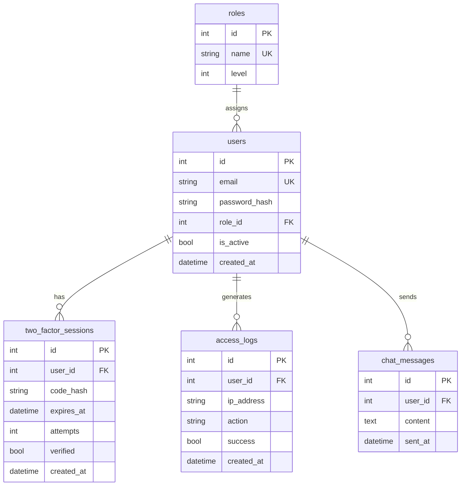

# Roadmap — Secteur Pourpre 🟣

> **Équipe : Secteur Pourpre** (11 membres) — Direction : Boudegna Philippe  
> Support : `tp-fullstack-cendres-et-vapeur-juin-2026-webdevoo-formation.pdf`  
> Formateur : Dufrène Valérian — Webdevoo Formation (juin 2026)

---

## Table des matières

1. [Notre mission](#1-notre-mission)
2. [Exigences du PDF — périmètre Pourpre](#2-exigences-du-pdf--périmètre-pourpre)
3. [Interfaces avec les autres secteurs](#3-interfaces-avec-les-autres-secteurs)
4. [État actuel du dépôt](#4-état-actuel-du-dépôt)
5. [Stack technique](#5-stack-technique)
6. [Planning sur 8 cycles](#6-planning-sur-8-cycles)
7. [Phase 0 — Cadrage (J1)](#7-phase-0--cadrage-j1)
8. [Phase 1 — Auth, rôles & transmissions sécurisées (J2–J4)](#8-phase-1--auth-rôles--transmissions-sécurisées-j2j4)
9. [Phase 2 — WebSockets & emails (J5–J6)](#9-phase-2--websockets--emails-j5j6)
10. [Phase 3 — Durcissement & intégration (J7–J8)](#10-phase-3--durcissement--intégration-j7j8)
11. [Phase 4 — Soutenance (J10)](#11-phase-4--soutenance-j10)
12. [Répartition suggérée](#12-répartition-suggérée)
13. [Tables SQL](#13-tables-sql)
14. [Endpoints](#14-endpoints)
15. [Frontend](#15-frontend)
16. [Structure de dossiers cible](#16-structure-de-dossiers-cible)
17. [Discipline de travail](#17-discipline-de-travail)
18. [Checklist de livraison](#18-checklist-de-livraison)

---

## 1. Notre mission

> *« L'élite composée de Boudegna Philippe. Vous assurez la sécurité des transmissions et l'intégrité des communications cryptées. »* — PDF, p. 2

Le **Secteur Pourpre** garantit que seuls les citoyens accrédités accèdent aux systèmes sensibles. **Pas d'accès au Dashboard sans preuve de citoyenneté** (code envoyé par email ou validation via service tiers).

### Livrables Pourpre

| Module | Exigence PDF | Priorité |
|--------|--------------|----------|
| **OAuth2 + 2FA** | Vérification d'identité avant Dashboard ; codes par email (Mailtrap / SendGrid) | 🔴 Critique |
| **RBAC** | 4 rôles : Invité, Utilisateur, Éditeur, Administrateur | 🔴 Critique |
| **Gestion des erreurs API** | Codes HTTP `401`, `403`, `404`, `500` formatés en JSON | 🔴 Critique |
| **Sessions 2FA & logs d'accès** | Intégrité référentielle SQL (sessions 2FA, logs d'accès) | 🔴 Critique |
| **Télégraphe de l'ombre** | Chat admin/éditeur, messages instantanés (WebSockets ou Long Polling) | 🔴 Critique |
| **Bureau de poste** | Formulaire contact envoyé par email (SMTP ou API dédiée) | 🟠 Haute |
| **Journal des survivants** | Alimenter le flux public avec les événements d'authentification | 🟠 Haute |
| **Frontend auth & chat** | Login, 2FA, routes protégées, interface télégraphe | 🔴 Critique |

---

## 2. Exigences du PDF — périmètre Pourpre

### Sécurité OAuth / 2FA (PDF, p. 3)

- Module de vérification d'identité obligatoire.
- Aucun accès au Dashboard sans preuve de citoyenneté.
- Codes de sécurité et missives de contact via **Mailtrap** ou **SendGrid** (paliers gratuits).
- Tout code bloqué par manque de configuration = défaillance de l'unité.

### Hiérarchie des rôles (PDF, p. 3)

| Rôle | Accès |
|------|-------|
| **Invité** | Lecture seule |
| **Utilisateur** | Achat / vote |
| **Éditeur** | Gestion catalogue |
| **Administrateur** | Contrôle total |

### Télégraphe de l'ombre (PDF, p. 5–6)

- Chat interne réservé aux **administrateurs et éditeurs**.
- Messages affichés instantanément.
- **WebSockets obligatoires**, Long Polling en secours.

### Bureau de poste (PDF, p. 6)

- Formulaire de contact dont le contenu est formaté et envoyé par email.

### Journal des survivants (PDF, p. 6)

- Flux de logs public, immersif.
- Le Pourpre y consigne les actions liées à l'authentification (connexions, échecs, déconnexions).

### Contraintes transverses qui nous concernent (PDF, p. 6–7)

- Maquette Figma **avant** tout codage.
- Backend Python, API REST JSON, base SQL.
- Accessibilité : contrastes élevés, navigation clavier, `aria-label` sur chaque composant interactif.
- Versioning `Major.minor.patch`, commits explicites, Kanban actif.
- Présentation individuelle : isoler ses lignes de code et justifier ses choix techniques.

---

## 3. Interfaces avec les autres secteurs

Le Pourpre ne code pas l'e-commerce, la bourse du cuivre, le planning ni la vitrine. Il **fournit** l'auth, le RBAC, le chat, l'email et les logs d'accès.

| Quand | Avec qui | Sujet |
|-------|----------|-------|
| **J1** | 🔴 Rouille | Schéma SQL : `users`, `roles`, `two_factor_sessions`, `access_logs`, `chat_messages` |
| **J1** | 🔵 Cobalt | Header `Authorization: Bearer`, format erreurs JSON, structure `backend/app/` |
| **J3** | 🔵 Cobalt | Injection middleware RBAC sur leurs routers |
| **J3** | 🎨 Frontend | Contrat `AuthContext` : login → 2FA → token → rôle |
| **J6** | 🔵 Cobalt + 🎨 Frontend | URL WebSocket, format messages chat, reconnexion |
| **J8** | Tous | Revue sécurité transversale avant soutenance |

### Format d'erreur JSON (convention API)

```json
{
  "error": {
    "code": "INVALID_2FA_CODE",
    "message": "Le code de vérification est invalide ou expiré.",
    "status": 401
  }
}
```

---

## 4. État actuel du dépôt

| Composant | État | Action |
|-----------|------|--------|
| **FastAPI** | 🟡 Squelette | CORS trop permissif (`*`) → à durcir |
| **Auth / 2FA** | 🔴 Absent | Priorité #1 |
| **RBAC** | 🔴 Absent | Middleware + dépendances FastAPI |
| **WebSockets** | 🔴 Absent | Télégraphe de l'ombre (J5–J6) |
| **Service email** | 🔴 Absent | Mailtrap / SendGrid |
| **Logs d'accès** | 🔴 Absent | Table + middleware |
| **Frontend auth** | 🔴 Absent | Login / 2FA / guards |
| **Tables SQL auth** | 🔴 Absent | Coordonner avec Rouille (J1) |

**Prochaine action** : cadrage J1 + module `backend/app/auth/` + maquettes login / 2FA / chat.

---

## 5. Stack technique

| Domaine | Technologie | Usage |
|---------|-------------|-------|
| API | FastAPI (recommandé PDF) | REST JSON |
| Auth | `OAuth2PasswordBearer` + JWT | Tokens access + refresh |
| Mots de passe | `passlib` + bcrypt | Hash sécurisé |
| 2FA | Code par email, session SQL | Table `two_factor_sessions` |
| Email | Mailtrap ou SendGrid | Codes 2FA + bureau de poste |
| Temps réel | WebSockets + Long Polling secours | Télégraphe de l'ombre |
| Frontend | React (choix dépôt) | Auth, guards, chat |
| Tests | pytest + httpx | Auth, RBAC, WS |

### Dépendances Python à ajouter

```
python-jose[cryptography]
passlib[bcrypt]
python-multipart
aiosmtplib
```

---

## 6. Planning sur 8 cycles

> *« Le Grand Conseil ne vous accorde que 8 cycles de 24 heures. »* — PDF, p. 1

```
J1          J2────J3────J4         J5────J6            J7────J8              J10
│           │                      │                   │                     │
Cadrage     NOYAU AUTH             CHAT + EMAIL        Durcissement          Soutenance
SQL auth    OAuth 2FA RBAC         Télégraphe          Tests + intégration   (groupe +
Maquettes   Logs accès             Bureau de poste       Polish auth           individuel)
```

| Cycle | Focus Pourpre | Jalons |
|-------|---------------|--------|
| **J1** | Cadrage | Tables auth validées (Rouille), maquettes login / 2FA / chat, `.env.example` |
| **J2** | Fondations | Modèles `User`, `Role`, `TwoFactorSession`, `AccessLog` + migrations |
| **J3** | 2FA | Login → email code → verify → JWT ; Dashboard bloqué sans 2FA |
| **J4** | RBAC | Middleware 4 rôles, erreurs JSON, logs d'accès |
| **J5** | WebSocket backend | `ws/chat`, auth WS, persistance messages |
| **J6** | WebSocket frontend + email | UI télégraphe, bureau de poste (contact) |
| **J7** | Durcissement | Rate limiting, CORS restrictif, tests sécurité |
| **J8** | Intégration | RBAC sur routers Cobalt, journal des survivants, polish auth UI |
| **J10** | Soutenance | Démo 2FA + chat + RBAC, justification choix techniques |

---

## 7. Phase 0 — Cadrage (J1)

> *« J1 : Maquettage, schéma SQL et initialisation des dépôts. »* — PDF, p. 8

### 7.1 Coordination Rouille — tables auth

- [ ] Valider le schéma ER (voir [section 13](#13-tables-sql))
- [ ] Contraintes : `email` unique, `role_id` FK, expiration `two_factor_sessions`
- [ ] Seed des 4 rôles : `guest`, `user`, `editor`, `admin`
- [ ] Seed compte admin + compte éditeur (tests chat)

### 7.2 Coordination Cobalt — conventions API

- [ ] Structure dossiers partagée `backend/app/`
- [ ] Format d'erreur JSON unifié
- [ ] Header `Authorization: Bearer <token>` sur routes protégées
- [ ] Matrice RBAC documentée

### 7.3 Maquettage (Figma — obligatoire avant codage)

- [ ] Écran **Connexion** (thème post-apo)
- [ ] Écran **Vérification 2FA** (code email)
- [ ] Écran **Accès refusé** (`401` / `403`)
- [ ] Widget **Télégraphe de l'ombre**
- [ ] Indicateur **session active** (nom, rôle, déconnexion)

### 7.4 Setup initial

- [ ] Créer `backend/app/auth/`, `security/`, `websockets/`, `services/email.py`
- [ ] Rédiger `.env.example` (`JWT_SECRET`, `MAILTRAP_*`, etc.)
- [ ] Kanban opérationnel (1 tâche minimum par membre)
- [ ] Tag : `v0.1.0-pourpre`

---

## 8. Phase 1 — Auth, rôles & transmissions sécurisées (J2–J4)

> *« J2–J4 : Développement du noyau (auth 2FA, rôles, API de base). »* — PDF, p. 8

### 8.1 Modèles & persistance (J2)

- [ ] Modèle `Role` (id, name, level 0–3)
- [ ] Modèle `User` (email, password_hash, role_id, is_active, created_at)
- [ ] Modèle `TwoFactorSession` (user_id, code_hash, expires_at, attempts, verified)
- [ ] Modèle `AccessLog` (user_id, ip, action, success, created_at)
- [ ] Migrations Alembic

### 8.2 RBAC (J2–J3)

- [ ] Enum `RoleLevel` backend
- [ ] Dépendance `get_current_user` (vérifie JWT)
- [ ] Dépendance `require_role(min_level)`
- [ ] Dépendance `require_2fa_verified`
- [ ] Tests : chaque rôle accepté / refusé

### 8.3 OAuth2 + 2FA (J3)

- [ ] `POST /auth/register` — inscription (rôle `user` par défaut)
- [ ] `POST /auth/login` — identifiants → code 2FA → envoi email
- [ ] `POST /auth/verify-2fa` — validation code → JWT
- [ ] `POST /auth/refresh` — renouvellement token
- [ ] `POST /auth/logout` — invalidation session
- [ ] Intégration Mailtrap / SendGrid
- [ ] **Règle métier PDF** : Dashboard inaccessible sans 2FA validée

### 8.4 Middleware & logs (J4)

- [ ] Handler global → JSON (`401`, `403`, `404`, `422`, `500`)
- [ ] Middleware : requêtes authentifiées → `access_logs`
- [ ] Log des échecs (mdp, 2FA, accès non autorisé)
- [ ] CORS : origines explicites (plus de `*`)
- [ ] Tag : `v0.2.0-pourpre`

### 8.5 Frontend auth (J3–J4)

- [ ] `AuthContext` : user, token, rôle, is2FAVerified
- [ ] Pages `Login.tsx` + `Verify2FA.tsx`
- [ ] Intercepteur fetch : header `Authorization`
- [ ] `ProtectedRoute` + `RoleGuard`
- [ ] Gestion expiration token
- [ ] `aria-label` sur formulaires auth

---

## 9. Phase 2 — WebSockets & emails (J5–J6)

> *« J5–J6 : … chat webSockets … »* — PDF, p. 8 (e-commerce et planning = autres secteurs)

### 9.1 Télégraphe de l'ombre — Backend (J5)

- [ ] Endpoint `WS /ws/chat`
- [ ] Auth WS : token JWT (query param ou premier message)
- [ ] Rôle ≥ Éditeur requis
- [ ] Modèle `ChatMessage` (user_id, content, sent_at)
- [ ] Broadcast instantané + persistance SQL
- [ ] `GET /chat/history` — historique REST
- [ ] Gestion déconnexion / reconnexion

### 9.2 Télégraphe de l'ombre — Frontend (J6)

- [ ] Hook `useWebSocket` avec reconnexion
- [ ] Page `admin/Chat.tsx` (Éditeur+)
- [ ] Messages temps réel + scroll auto
- [ ] Indicateur connecté / déconnecté
- [ ] **Fallback Long Polling** (exigence PDF)
- [ ] Style télégramme post-apo

### 9.3 Bureau de poste (J6)

- [ ] `POST /contact` — validation + rate limiting
- [ ] `EmailService` réutilisable (2FA + contact)
- [ ] Template HTML email contact
- [ ] Protection anti-spam
- [ ] Tag : `v0.5.0-pourpre`

---

## 10. Phase 3 — Durcissement & intégration (J7–J8)

> *« J7–J8 : Intégration des modules de survie, polissage CSS et tests finaux. »* — PDF, p. 8

### 10.1 Durcissement (J7)

- [ ] Rate limiting (login, contact, 2FA)
- [ ] Validation Pydantic stricte
- [ ] Expiration refresh tokens
- [ ] Headers sécurité (`X-Content-Type-Options`, `X-Frame-Options`)
- [ ] Aucun secret en dur (uniquement `.env`)
- [ ] Revue OWASP basique

### 10.2 Tests sécurité (J7)

- [ ] Login sans 2FA → Dashboard refusé
- [ ] Token expiré → `401`
- [ ] Utilisateur tente route éditeur → `403`
- [ ] WS sans token ou rôle insuffisant → refusé
- [ ] Rate limit contact → `429`

### 10.3 Intégration (J8)

- [ ] Middleware RBAC sur routers Cobalt
- [ ] Matrice RBAC partagée avec l'équipe
- [ ] Journal des survivants : événements auth (connexion, échec, déconnexion)
- [ ] Polish UI auth (rouages au chargement 2FA, feedback accessible)
- [ ] Tag : `v0.8.0-pourpre` → `v1.0.0-pourpre`

---

## 11. Phase 4 — Soutenance (J10)

> *« J10 : Soutenance devant le Conseil (groupe + individuel). »* — PDF, p. 8

### Scénario démo sécurité

1. Accès admin sans login → `401`
2. Login → réception code 2FA (Mailtrap)
3. Validation 2FA → accès Dashboard
4. Utilisateur standard tente le chat → `403`
5. Éditeur ouvre le télégraphe → message instantané
6. Déconnexion → session invalidée

### Arguments à présenter

- Pourquoi **2FA obligatoire** avant le Dashboard (exigence PDF)
- Choix **JWT** + refresh token
- **RBAC** enforced côté serveur (dépendances FastAPI)
- **WebSocket** sécurisé (auth à la connexion)
- Stratégie **email** (Mailtrap dev / SendGrid prod)
- **Logs d'accès** pour audit

### Préparation individuelle (PDF, p. 7)

- [ ] Chaque membre identifie ses commits
- [ ] Fiche : choix techniques (JWT, bcrypt, WS vs polling, Mailtrap)

---

## 12. Répartition suggérée

> 11 membres — à adapter selon compétences.

| Sous-équipe | Effectif | Missions |
|-------------|----------|----------|
| **Auth Backend** | 3 | Modèles, JWT, 2FA, `/auth/*` |
| **Sécurité & RBAC** | 2 | Middleware, rôles, erreurs JSON, logs |
| **WebSocket** | 2 | Backend WS, persistance, Long Polling |
| **Email** | 1 | Mailtrap/SendGrid, templates, contact |
| **Auth Frontend** | 2 | Login, 2FA, AuthContext, guards |
| **Chat Frontend** | 1 | UI télégraphe, hook WebSocket |

---

## 13. Tables SQL

> Schéma défini par le Pourpre, validé par Rouille. Intégrité référentielle exigée par le PDF.



### Événements `access_logs`

| Action | success=true | success=false |
|--------|--------------|---------------|
| `login` | Identifiants OK, 2FA envoyé | Email/mdp incorrect |
| `verify_2fa` | JWT émis | Code invalide / expiré |
| `logout` | Session terminée | — |
| `access_denied` | — | Rôle insuffisant |
| `ws_connect` | Chat ouvert (éditeur+) | Token invalide ou rôle user |

---

## 14. Endpoints

### Auth & sécurité

| Méthode | Route | Rôle min. | Description |
|---------|-------|-----------|-------------|
| POST | `/auth/register` | — | Inscription |
| POST | `/auth/login` | — | Connexion → envoi 2FA |
| POST | `/auth/verify-2fa` | — | Validation code → JWT |
| POST | `/auth/refresh` | User | Renouvellement token |
| POST | `/auth/logout` | User | Invalidation session |
| GET | `/users/me` | User | Profil + rôle |

### Chat & communication

| Méthode | Route | Rôle min. | Description |
|---------|-------|-----------|-------------|
| WS | `/ws/chat` | Éditeur | Télégraphe temps réel |
| GET | `/chat/history` | Éditeur | Historique messages |
| POST | `/contact` | Invité | Bureau de poste |

### Middleware fourni aux autres secteurs

| Dépendance | Usage |
|------------|-------|
| `get_current_user` | Extrait user du JWT |
| `require_role(n)` | Bloque si niveau insuffisant |
| `require_2fa_verified` | Bloque Dashboard sans 2FA |
| `log_access(action)` | Écrit dans `access_logs` |

---

## 15. Frontend

```
frontend/src/
├── contexts/
│   └── AuthContext.tsx
├── pages/
│   ├── Login.tsx
│   ├── Verify2FA.tsx
│   ├── AccessDenied.tsx
│   └── admin/
│       └── Chat.tsx
├── components/
│   ├── auth/
│   │   ├── ProtectedRoute.tsx
│   │   ├── RoleGuard.tsx
│   │   └── SessionIndicator.tsx
│   └── chat/
│       ├── ChatPanel.tsx
│       ├── ChatMessage.tsx
│       └── ConnectionStatus.tsx
├── hooks/
│   ├── useAuth.ts
│   └── useWebSocket.ts
└── services/
    ├── authApi.ts
    └── chatApi.ts
```

---

## 16. Structure de dossiers cible

```
backend/app/
├── auth/
│   ├── router.py
│   ├── schemas.py
│   ├── service.py
│   └── dependencies.py
├── security/
│   ├── jwt.py
│   ├── password.py
│   ├── rbac.py
│   └── exceptions.py
├── websockets/
│   ├── chat.py
│   └── auth.py
├── services/
│   └── email.py
├── middleware/
│   ├── access_log.py
│   └── rate_limit.py
└── models/
    ├── user.py
    ├── role.py
    ├── two_factor_session.py
    ├── access_log.py
    └── chat_message.py
```

---

## 17. Discipline de travail

### Versioning (PDF : `Major.minor.patch`)

```
v0.1.0-pourpre   Cadrage + tables auth
v0.2.0-pourpre   Auth + 2FA + JWT
v0.3.0-pourpre   RBAC middleware
v0.5.0-pourpre   WebSocket chat + email
v0.8.0-pourpre   Durcissement + tests
v1.0.0-pourpre   Livraison soutenance
```

### Commits

```
feat(pourpre-auth): implémenter vérification 2FA par email
feat(pourpre-ws): ajouter endpoint WebSocket chat admin
fix(pourpre-rbac): corriger accès éditeur sur /chat/history
test(pourpre): couvrir le refus Dashboard sans 2FA
```

### Variables d'environnement

```env
JWT_SECRET=changez-moi-en-production
JWT_ALGORITHM=HS256
JWT_ACCESS_EXPIRE_MINUTES=30
JWT_REFRESH_EXPIRE_DAYS=7

MAIL_PROVIDER=mailtrap
MAILTRAP_API_TOKEN=...
SMTP_FROM=noreply@zone-franche.local

ALLOWED_ORIGINS=http://localhost:5173
WS_HEARTBEAT_SECONDS=30
```

---

## 18. Checklist de livraison

### Auth & identité

- [ ] Inscription + connexion fonctionnelles
- [ ] 2FA par email (Mailtrap / SendGrid configuré)
- [ ] JWT access + refresh
- [ ] Dashboard inaccessible sans 2FA validée
- [ ] Déconnexion effective

### RBAC

- [ ] 4 rôles implémentés et testés
- [ ] Réponses `401` / `403` en JSON structuré
- [ ] Matrice RBAC documentée

### Communications

- [ ] WebSocket chat admin/éditeur opérationnel
- [ ] Messages persistés en SQL
- [ ] Fallback Long Polling fonctionnel
- [ ] Bureau de poste (contact par email)
- [ ] Rate limiting sur contact et login

### Traçabilité

- [ ] `access_logs` alimenté (succès + échecs)
- [ ] Événements auth dans le journal des survivants

### Frontend

- [ ] Pages Login + Verify2FA
- [ ] AuthContext + intercepteur API
- [ ] ProtectedRoute + RoleGuard
- [ ] UI Télégraphe de l'ombre
- [ ] `aria-label` sur composants interactifs (exigence PDF)

### Qualité

- [ ] Tests auth / RBAC / WS passants
- [ ] Aucun secret commité
- [ ] CORS durci
- [ ] Chaque membre a des commits identifiables
- [ ] Scénario démo répété

---

*Dernière mise à jour : juin 2026 — Roadmap Secteur Pourpre 🟣 (alignée PDF)*
